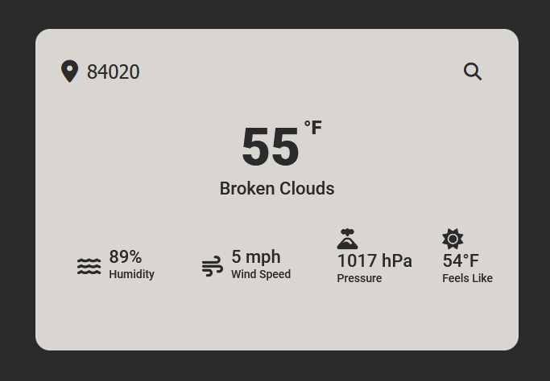

# weather-api-example
Basic weather api I made based on https://github.com/AsmrProg-YT/100-days-of-javascript/tree/master/Day%20%2310%20-%20Weather%20App. I made a few changes, and added more info from the API to show I am able to use APIs. 


## Warning
You need to get your own api key and replace it in index.js file on line 9 :

```javascript
const APIKey = 'Your Api Key';
```
I'm not leaving my API key out in public :)

# Screenshot
Here's my screenshot showing it's working, as of 2024-03-28 @ 12:18 MDT:


